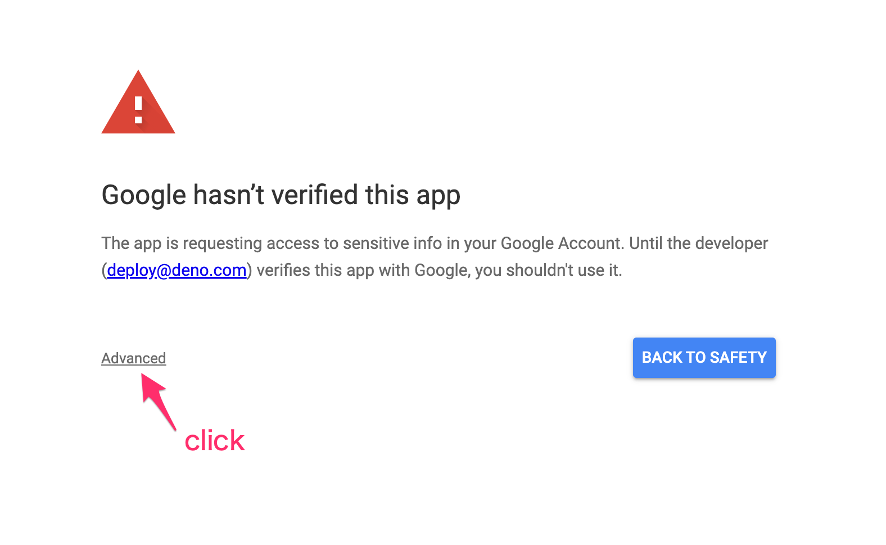
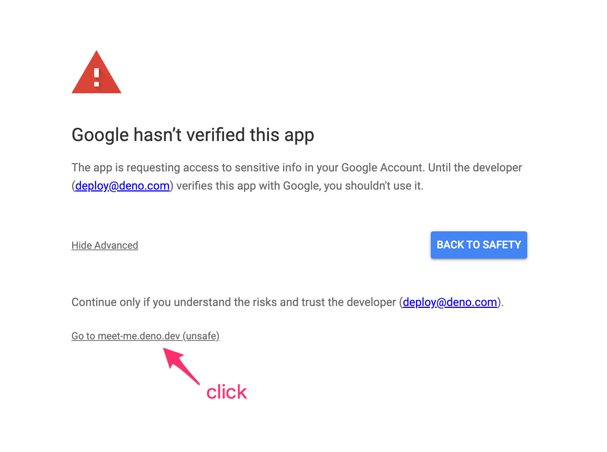
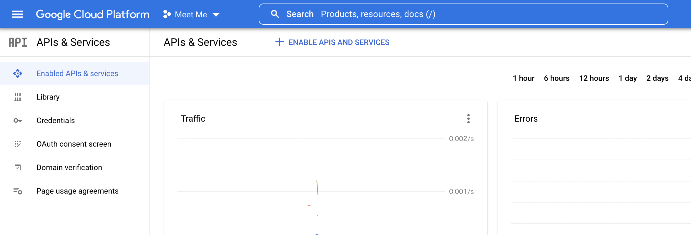

# Meet Me

> [calendly](https://calendly.com/) clone in Deno

## Google Trust and Safety verification

This app uses Google Calendar API and the app is now being reviewed by Google's
Trust and Safety team for verification. If you'd like to try this app by
yourself at this point, please click the below links and approve the app on your
own risk while signing in to the app.





## Development

First copy `.env.example` to `.env` and set `CLIENT_ID`, `CLIENT_SECRET`, and
`FIREBASE_*` appropriate values.

Then run the deployment locally:

```sh
deno task dev
```

This starts Meet Me service in your local machine.

## Testing

Start the firestore emulator by the below command (You need Node.js and Java >
11 to run the emulator):

```
deno task firestore-emulator
```

In another terminal window, run the below command to run the unit tests:

```
deno task test
```

## Visual Design

https://www.figma.com/file/P0XsTDIeiwNhm8jFS03gwz/Deno-Cal

## LICENSE

MIT License

## Notes

### How to configure GCP Resources

You need [Google Cloud Platform](https://console.cloud.google.com/) Project to
develop this app.

- First go to [GCP Console](https://console.cloud.google.com/) and create a
  project.
- Then go to `APIs & Services`.
- Enable Calendar API from `+ ENABLE APIS AND SERVICES` link.
  
- In `OAuth consent screen` tab, set up the project's consent screen.
- In `Credentials` tab, create `OAuth client ID` with `Web application` type.
  - Under Authorized JavaScript origins add `http://localhost:3000`
  - Under Authorized redirect URIs add `http://localhost:3000/api/authorize`
- Then you'll find client id and client secret of the oauth client.
- Copy those values and set them as `CLIENT_ID` and `CLIENT_SECRET` in `.env`

Now setup Firebase:

- Go to https://console.firebase.google.com/ and click Create a project.
- Select the project you created above.
- Select your preferred billing and analytics options.
- Wait while your Firebase app is created.
- From the Overview screen add a Web app (currently represented with a `</>` icon).
- Don't add Firebase hosting, as you'll be using Deno Deploy.
- You'll be presented with some JavaScript code including `firebaseConfig`. Copy those values to the appropriate place in `.env`. (If you didn't enable analytics there will not be a value for `FIREBASE_MEASUREMENT_ID`).
- Click back to the Overview screen, click Cloud Firestore, and then Create database.
- Start in production mode.
- Select a Firestore location, the default is probably good, and then Enable.
- Click to the Rules tab, copy the content of `firestore.rules`, and click Publish.
- Now head to Overview, then Storage. You might need to click See all Build features.
- Under the Rules tab, copy the content of `storage.rules`, and click Publish.

You should now be able to start the app locally with the instructions in [Development](#development). If you see a an error similar to `Could not reach Cloud Firestore backend` then you may need to wait awhile for Firestore to be available.

For Deno Land employees:

- You can find these values in `Meet Me API Credentials` section in the password
  manager.
