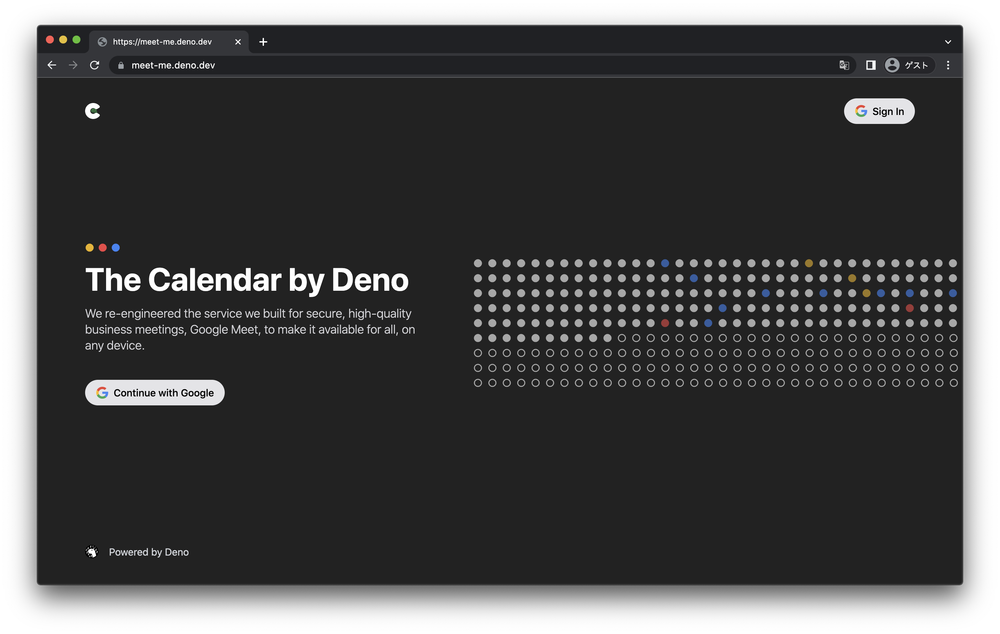

# showcase_cal

> [calendly](https://calendly.com/) clone in Deno

## Development

First copy `.env.example` to `.env` and replace `CLIENT_ID` and `CLIENT_SECRET`
to appropriate values.

Then run the deployment locally:

```sh
deno task dev
```

## Visual Design

https://www.figma.com/file/P0XsTDIeiwNhm8jFS03gwz/Deno-Cal

## LICENSE

MIT

## Notes

### How to create `CLIENT_ID` and `CLEINT_SECRET` values in Google Cloud Platform

You need [Google Cloud Platform](https://console.cloud.google.com/) Project to
develop this app.

- First go to [GCP Console](https://console.cloud.google.com/) and create a
  project.
- Then go to `APIs & Services`.
- In `OAuth consent screen` tab, set up the project's consent screen.
- In `Credentials` tab, create `OAuth client ID` with `Web application` type.
- TODO(kt3k): document the parameters to set.
- Then you'll find client id and client secrent of the oauth client.
- Copy those values and set them as `CLIENT_ID` and `CLIENT_SECRET`.
